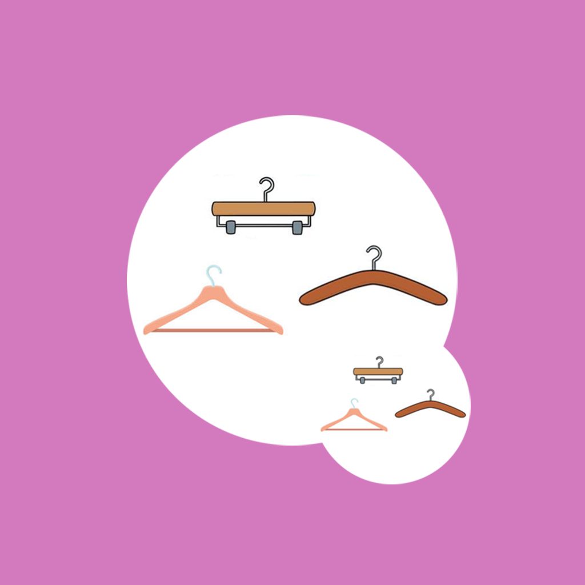

## 欢迎来到 家庭衣架分类存放记录工具

在日常生活中我们有经常需要用到衣架，不同的衣架有不同的特点和用途。衣架存放不合理不但容易显得比较乱，而且也不方便拿取使用。我们可以给家里的衣架分类，例如平时晾晒衣服的衣架，平时挂西装用的衣架等。我们还可以记录家里不同类型的衣架的数量，衣架的类型，不同的功能用途和存放位置等信息。这样当我们需要用到衣架的时候，就能方便快捷的找到我们想要的衣架了。

如果您遇到什么需要解答的问题，请发送您的问题到以下邮箱。

我们将第一时间为您解答。

### 邮箱地址: zhanghesongyuan7@126.com

谢谢！
